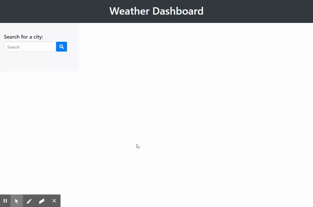

# Homework 06 Server-Side APIs: Weather Dashboard

## Description
In this repository, you will find a simple weather application that allows users to search for weather forecasts by city. This application runs in the browser and features dynamically updated HTML and CSS powered by jQuery. 

Also utilized in this application were:
* The OpenWeather API, to retrieve weather data for cities
* Moment.js library, to retrieve current date

## How it Works
Users are directed to a web page that features:
* A header with the title of the application
* A search input
* A search button

Once a user inputs a city and clicks the search button, they are presented with:
* The title of the city
* The current date
* A weather icon depicting the current conditions
* The current temperature
* The current humidity level
* The current wind speed
* The current UV index, color coded to indicate whether the conditions are favorable, moderate or severe
* The 5-day forecast, including the date, a weather icon depicting the current conditions, the temperature and the humidity level.

## Bugs
I was unable to create a search history.

## Mock-up
The finished project can be deployed [here](https://jaccihorvath.github.io/weather-app/).

## Demo

